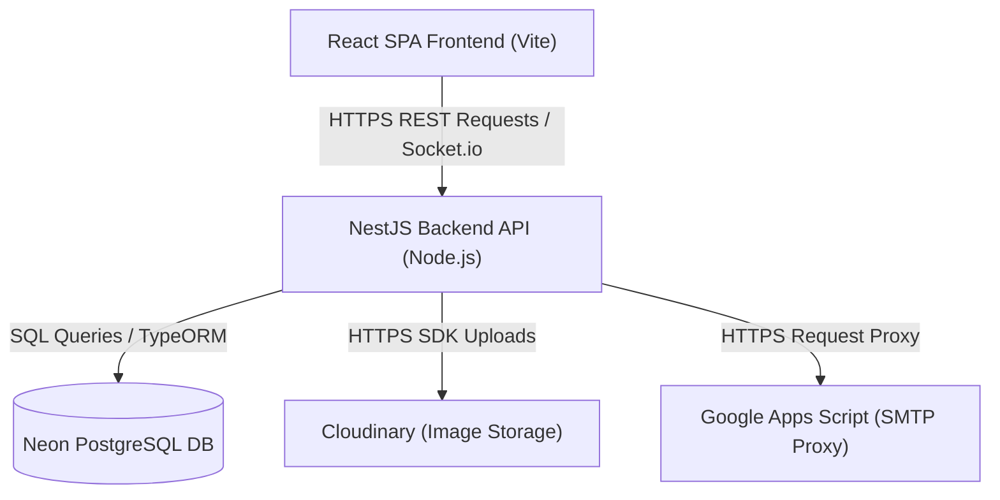
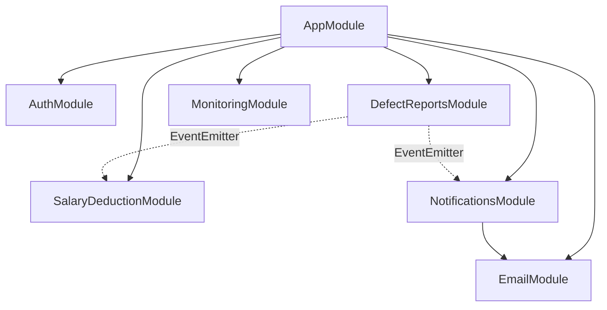
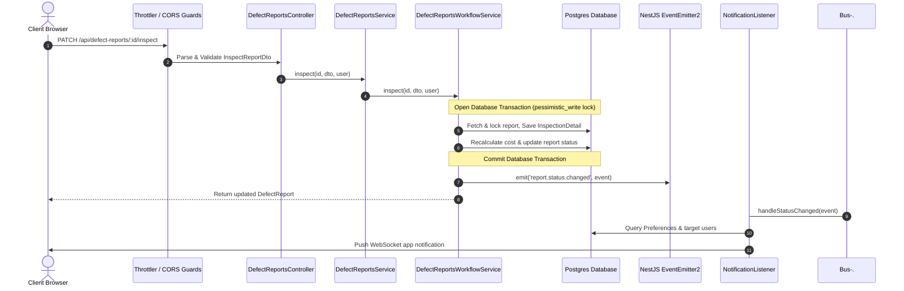

# System Architecture Document

This document provides a comprehensive overview of the **Error Correction Report (ECR) Digitization System's** high-level architecture, module dependency structure, request lifecycle, and data flow patterns.

---

## 1. High-Level Design Overview

The application is structured as a decoupled client-server system designed to run on containerized environments (such as Render) with external persistent relational storage (Neon PostgreSQL).

---

## 2. Decoupled Service Tier

### Backend (NestJS Server)
- **Framework Model:** Modular dependency injection runtime leveraging controller-service-repository patterns.
- **Data Tier:** PostgreSQL integration using TypeORM (active connection pooler, pessimistic write locking).
- **Event Bus:** `@nestjs/event-emitter` decouples state machine transitions from resource-intensive actions (app notification creation and SMTP email dispatching).

### Frontend (React SPA)
- **Runtime:** React 18 powered by Vite.
- **Client Cache Management:** React Query (`@tanstack/react-query`) handles query caching, mutation states, and automatic cache invalidation (Query Keys matching REST endpoints).
- **Styling & UX:** Vanilla CSS custom variables, skeletons, toast alerts (`react-hot-toast`), and responsive CSS grids.

---

## 3. Module Dependency Diagram

The following diagram illustrates how components and services depend on each other inside the NestJS server.

---

## 4. End-to-End Request Data Flow

This lifecycle trace demonstrates what happens when an operator or inspector submits an action:

---

## 5. Observability & Logging Architecture

The application implements observability at three critical points:
1. **Metrics Interceptor (`MetricsInterceptor`):** Tracks latency, request/response metrics, and failed exception durations. Logs outputs using the NestJS Logger.
2. **Monitoring Dashboard (`MonitoringService`):** Exposes system metrics (active connections, RAM/CPU load, email queue latency, and transaction threshold alerts) through a secured endpoint `/api/admin/monitoring/dashboard`.
3. **Structured Event Logs:** Explicit diagnostic logs written with tag prefixes (`[EMAIL_DIAGNOSTICS]`, `[SALARY_DEDUCTION_WARN]`) facilitate quick analysis of production application logs.
