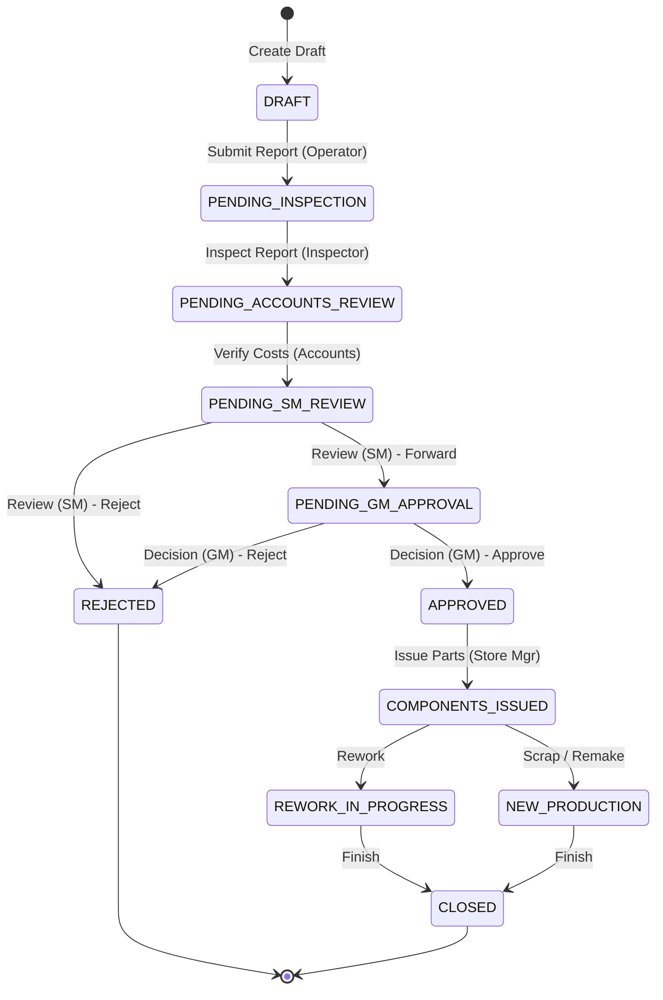

# Workflow & Process Integrity Documentation

This document describes the state machine transitions, role-based authorization matrix, and financial cost aggregation logic.

---

## 1. Unified ECR Workflow Transitions

A Defect Report flows through a strict state machine from creation through resolution.

### Transition Skip-Ahead Rules
To optimize operations, senior roles skip early steps when raising a report:
- **Operator raises:** Enters `PENDING_INSPECTION` (standard flow).
- **Inspector raises:** Mandates inline inspection, skipping directly to `PENDING_ACCOUNTS_REVIEW`.
- **Senior Manager raises:** Requires inline inspection and inline SM review, skipping directly to `PENDING_GM_APPROVAL`.

---

## 2. Role-Based Permissions & Field Edits

To maintain auditing standards, field modifications are restricted based on user role and report status:

| User Role | Allowed Actions | Editable Fields | Required Status |
| :--- | :--- | :--- | :--- |
| **Operator** | Create Report, Edit Draft | Description, Part/Batch No, Qty, Stage | `DRAFT` |
| **Inspector** | Perform Inspection | Error Type, Root Cause, Decision, Loss Amount | `PENDING_INSPECTION` |
| **Accounts** | Verify & Submit ECR | Material Cost, Labour Cost, Other Cost, costRemarks, componentName, errorTypeName | `PENDING_ACCOUNTS_REVIEW` |
| **Senior Manager** | Approve / Reject SM review | loopholeNote, decisionNote, biasedFlag, rejectionStageCosts, componentName, errorTypeName | `PENDING_SM_REVIEW` |
| **General Manager** | Final ECR Decision | costEstimate, stageOfFailure, rejectionStageCosts, lossAmount, componentName, errorTypeName | `PENDING_GM_APPROVAL` |
| **Store Manager** | Issue Components | issueRemarks | `APPROVED` |

---

## 3. Financial Cost Aggregation Formulas

Total Cost calculations are executed on the backend during inspection updates and field edits:

$$\text{Total Cost} = \text{Material Cost} + \text{Labour Cost} + \text{Other Cost} + \sum (\text{Active Stage Costs})$$

### Calculating Active Stage Costs
If the ECR template is a **Rejection** process:
1. The template references a predefined path of stages (defined in `PROCESS_TEMPLATES`).
2. The active stages are resolved by slicing the stage template up to the `failedStage` index (inclusive).
3. The costs of these active stages are retrieved from `rejectionStageCosts` (fallback to `0` if empty) and summed.
4. Total Cost is rounded and returned to the database.
